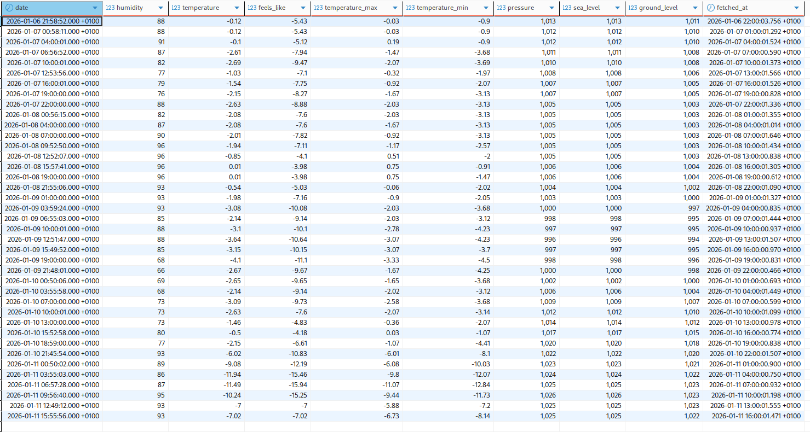
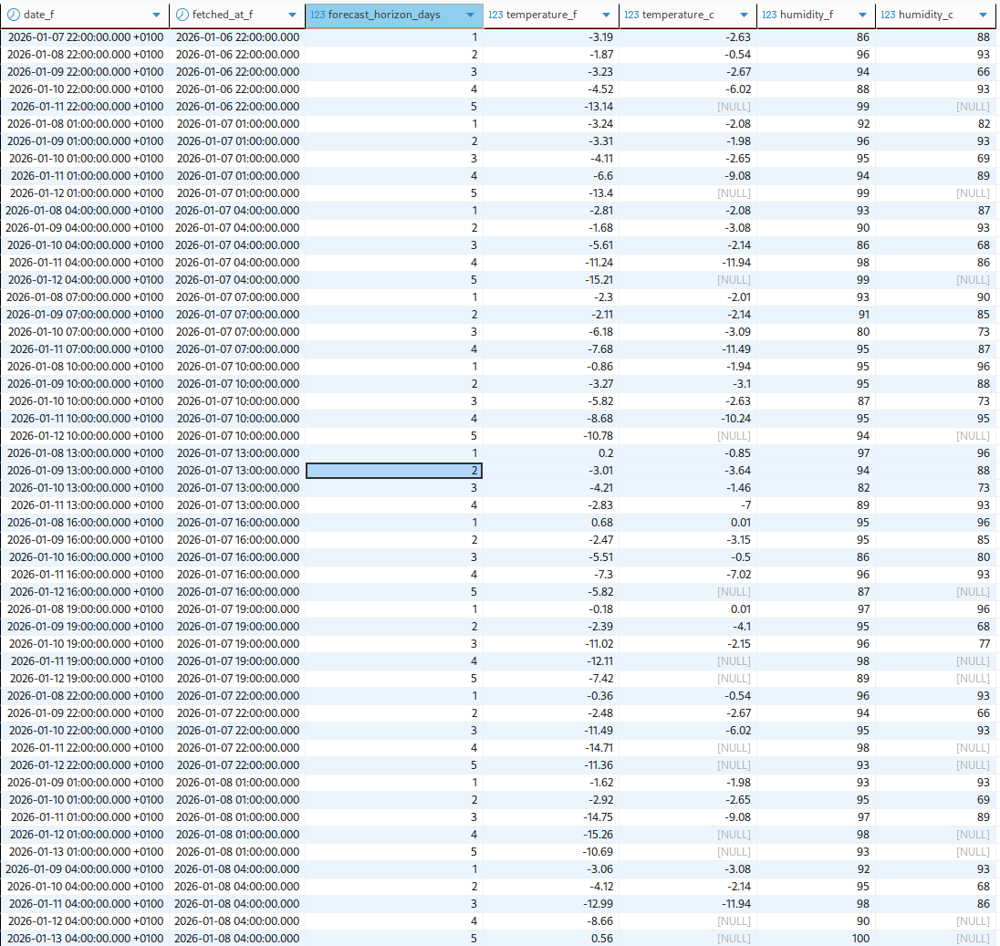

# Automated Weather Data Pipeline with Airflow and PostgreSQL
This project demonstrates a simple end-to-end data pipeline for fetching data from the 
OpenWeatherMap API. The pipeline includes both current weather data and five-day forecast,
stores them in a PostgreSQL database and transforms the data using SQL to enable the comparison 
between current and forecast values.

Automation is handled through a combination of Apache Airflow and Linux cron jobs for scheduled
SQL execution.

## Project Overview
The diagram illustrates as shown below the end-to-end architecture of the weather data pipeline. 
Weather data is retrieved from the OpenWeatherMap API using Python scripts and stored in a 
PostgreSQL database. Apache Airflow is used to orchestrate and schedule the data collection 
workflows, while SQL-based transformations are executed to combine and compare forecast and current 
weather data. The entire pipeline runs on a Linux within a local network and is maintained through 
version control using Git.

   

## Table Overview

### Raw Tables
- **weather_data_current**  
  Stores current weather observations retrieved from the OpenWeatherMap API.
  
  

   
  

  
- **weather_data_forecast**  
  Stores five-day weather forecast data retrieved from the OpenWeatherMap API.
  
  

   
  

### Analytics Tables
- **weather_forecast_vs_current (temperature and humidity only)**  
  Derived table combining forecast and current weather data, enabling direct comparison
  between predicted and observed values. Includes the forecast horizon in days.

  

   
  

## Tech Stack
- Python
- SQL (PostgreSQL)
- Apache Airflow
- PostgreSQL
- Linux & cron
- OpenWeatherMap API
- Git

## Next Steps

- **Code refactoring**: The current Python scripts for fetching current and forecast
  weather data have similar logic and could be refactored to reduce duplication and
  improve maintainability.

- **Extended analysis**: Additional analytical metrics (e.g. forecast accuracy by
  forecast horizon) and visualizations are planned.

