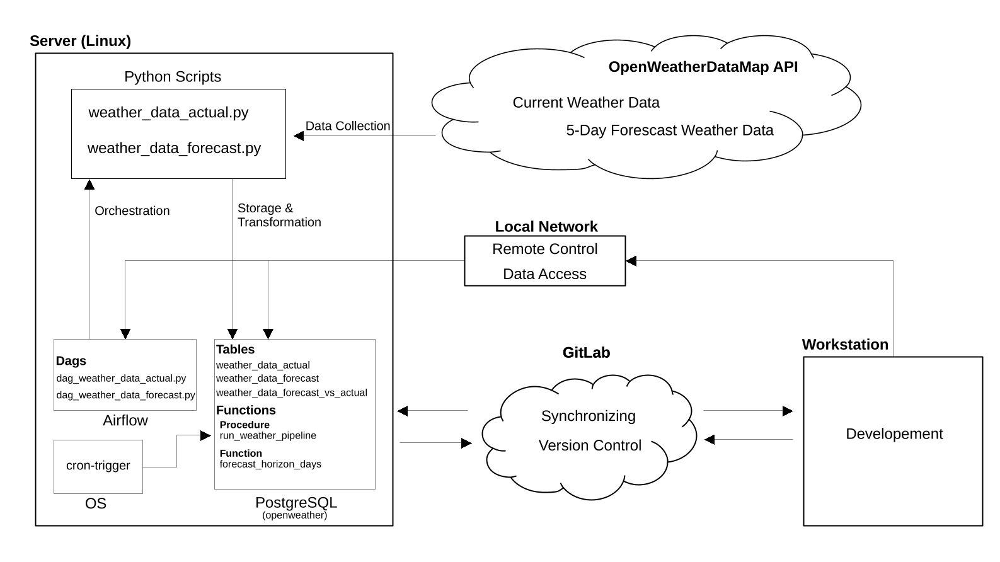
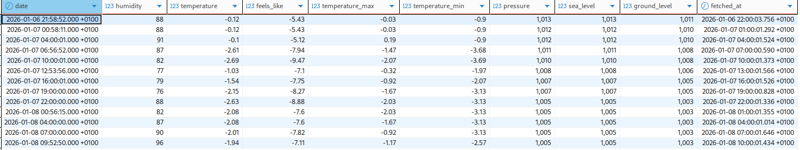
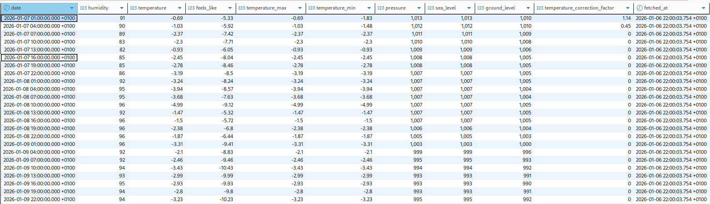
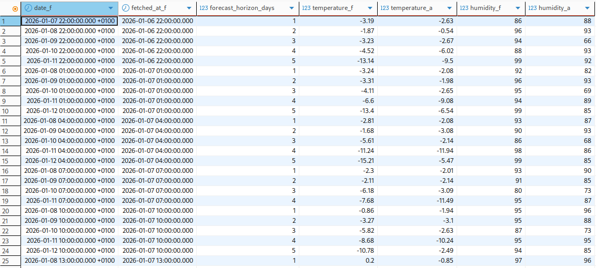

# Automated Weather Data Pipeline with Airflow and PostgreSQL

This project demonstrates a simple end-to-end data pipeline for collecting weather data from the
OpenWeatherMap API. The pipeline processes both current weather data and five-day forecasts, stores
the data in a PostgreSQL database, and transforms it using SQL to enable comparisons between
forecasted and actual weather values.

Automation is handled through a combination of Apache Airflow for workflow orchestration and Linux
cron jobs for scheduled SQL execution.

## Project Overview

The diagram below illustrates the end-to-end architecture of the weather data pipeline. Weather
data is retrieved from the OpenWeatherMap API using Python scripts and stored in a PostgreSQL
database. Apache Airflow is used to orchestrate and schedule the data collection workflows, while
SQL-based transformations combine and compare forecast and current weather data.

The entire pipeline runs on a Linux server within a local network and is maintained through version
control using Git.

   

## Tech Stack
- Python
- SQL (PostgreSQL)
- Apache Airflow
- PostgreSQL
- Linux & cron
- OpenWeatherMap API
- Git

## Data Tables Ovverview

### Raw Tables
- **weather_data_actual**  
  Stores current weather observations retrieved from the OpenWeatherMap API.
  

   
  

- **weather_data_forecast**  
  Stores five-day weather forecast data retrieved from the OpenWeatherMap API.
  

   
  

### Analytics Tables
- **weather_forecast_vs_actual**  
  Derived table combining forecast and current weather data, enabling direct comparison
  between predicted and observed values. Includes the forecast horizon in days.
  

   
  

## Next Steps
- Extend analytical capabilities and visualizations
