# Automated Weather Data Pipeline with Airflow and PostgreSQL

This project demonstrates a simple end-to-end data pipeline for collecting weather data from the
OpenWeatherMap API. The pipeline processes both actual weather data and five-day forecasts, stores
the data in a PostgreSQL database, and transforms it using SQL to enable comparisons between
forecasted and actual weather values.

Automation is handled through a combination of Apache Airflow for workflow orchestration and Linux
cron jobs for scheduled SQL execution.

## Project Overview

The diagram below illustrates the end-to-end architecture of the weather data pipeline. Weather
data is retrieved from the OpenWeatherMap API using Python scripts and stored in a PostgreSQL
database. Apache Airflow is used to orchestrate and schedule the data collection workflows, while
SQL-based transformations combine and compare forecast and actual weather data.

The entire pipeline runs on a Linux server within a local network and is maintained through version
control using Git.

   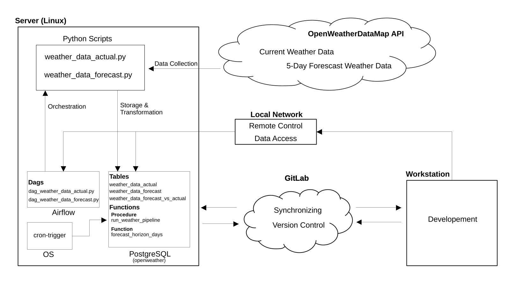

## Tech Stack
- Python
- SQL (PostgreSQL)
- Apache Airflow
- PostgreSQL
- Linux & cron
- OpenWeatherMap API
- Git

## Data Tables Ovverview

### Raw Tables
- **weather_data_actual**  
  Stores actual weather observations retrieved from the OpenWeatherMap API.
  

   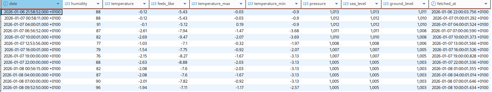
  

- **weather_data_forecast**  
  Stores five-day weather forecast data retrieved from the OpenWeatherMap API.
  

   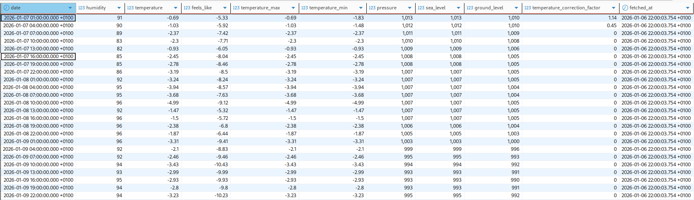
  

### Analytics Tables
- **weather_forecast_vs_actual**  
  Derived table combining forecast and actual weather data, enabling direct comparison
  between predicted and observed values. Includes the forecast horizon in days.
  

   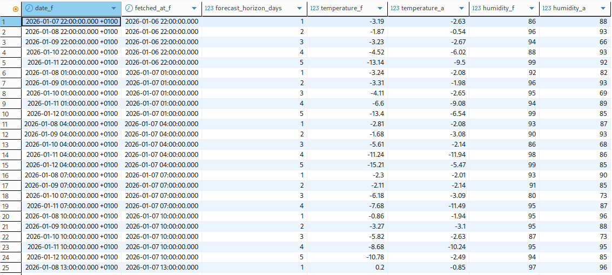
  

# 📊 Forecast Evaluation Report

⚠️ **Disclaimer:**  
*This project presents an exploratory analysis of weather forecast data obtained from OpenWeatherMap. Interpretation of the results and detailed insights will be added in a future update. The analyses presented here are exploratory and for demonstration purposes only.*

## Overview

This repository evaluates short-term temperature forecasts against observed values.

**Evaluation Scope**
- Issuance time: 01:00, 04:00, 07:00, 10:00, 13:00, 16:00, 19:00, 22:00
- Lead times: 1 to 5 days
- Valid times: 01:00, 04:00, 07:00, 10:00, 13:00, 16:00, 19:00, 22:00
- Evaluation period: 2026-01-06 22:00 – 2026-02-16 11:00
  
❗ Caution: Due to a technical issue, the system had to be shut down. 
This is shown as a grey area in the charts.

---

<strong>📌 1. Summary Statistics</strong>

### Key Metrics (as of 2026-02-16 11:00)

|   Day |   Bias (°C) |   Bias Δ% |   MAE (°C) |   MAE Δ% |   RMSE (°C) |   RMSE Δ% |   MAE/RMSE |   MAE/RMSE Δ% |   wMAPE (%) |   wMAPE Δ% |   Hit (%) |   Hit Δ% |   Tol. (°C) +/- |
|------:|------------:|----------:|-----------:|---------:|------------:|----------:|-----------:|--------------:|------------:|-----------:|----------:|---------:|----------------:|
|     1 |       -0.05 |    nan    |       1.07 |   nan    |        1.36 |    nan    |       0.79 |        nan    |       33.4  |     nan    |     79.54 |   nan    |             2   |
|     2 |       -0.15 |    192.13 |       1.19 |    10.95 |        1.6  |     17.71 |       0.75 |         -5.74 |       33.63 |       0.71 |     74.52 |    -6.31 |             2.5 |
|     3 |       -0.3  |     95.06 |       1.53 |    28.71 |        2.01 |     26.1  |       0.76 |          2.07 |       43.64 |      29.76 |     70    |    -6.06 |             3   |
|     4 |       -0.41 |     37.16 |       1.76 |    14.63 |        2.45 |     21.66 |       0.72 |         -5.78 |       50.44 |      15.59 |     67.69 |    -3.3  |             3.5 |
|     5 |       -1.58 |    282.85 |       2.69 |    53.02 |        3.67 |     49.61 |       0.73 |          2.28 |       83.85 |      66.22 |     58.46 |   -13.64 |             4   |
 

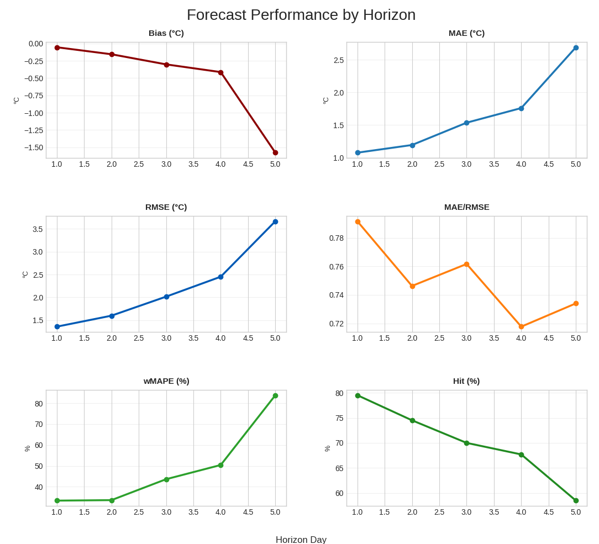

### Interpretation

*Interpretation will follow in a future update.*

<strong>📈 2. Forecast vs. Actual (°C) Over Time</strong>

 
  
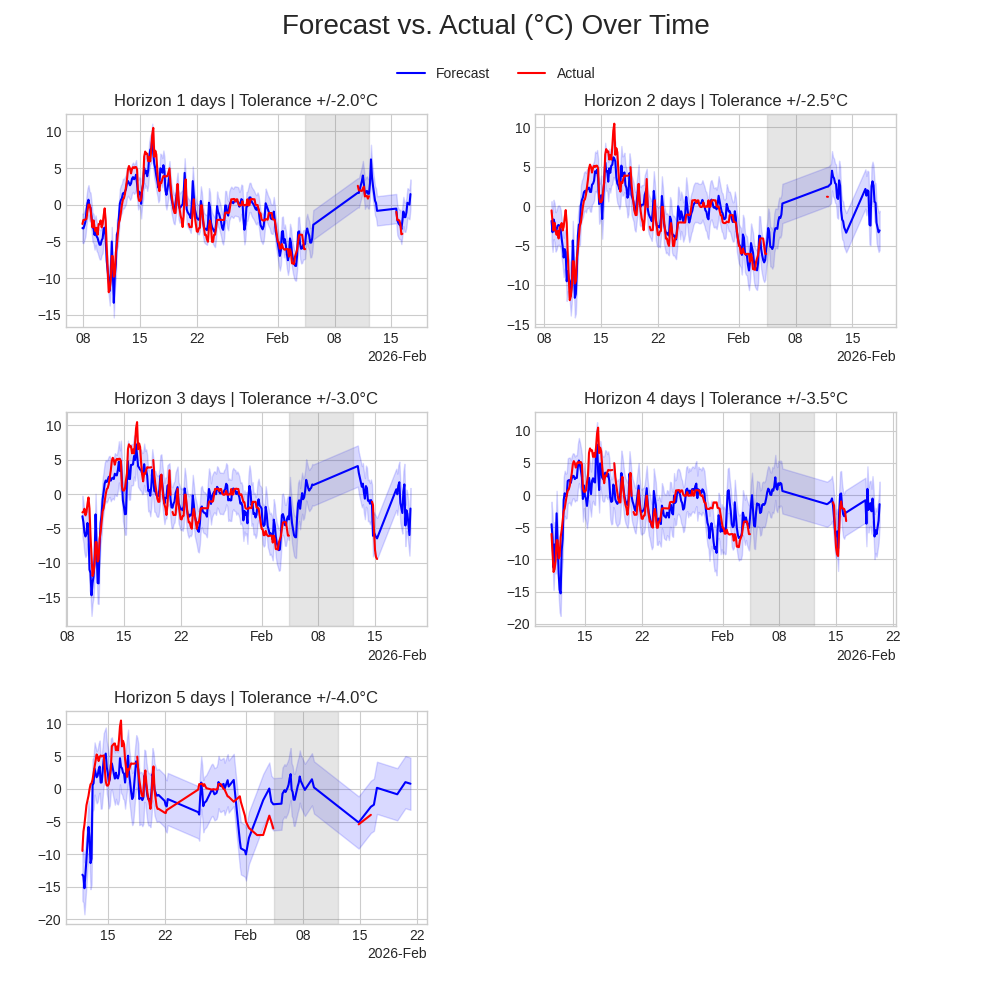

### Interpretation

*Interpretation will follow in a future update.*

<strong>📉 3. Error & Mean Error (°C) Over Time</strong>

 
  
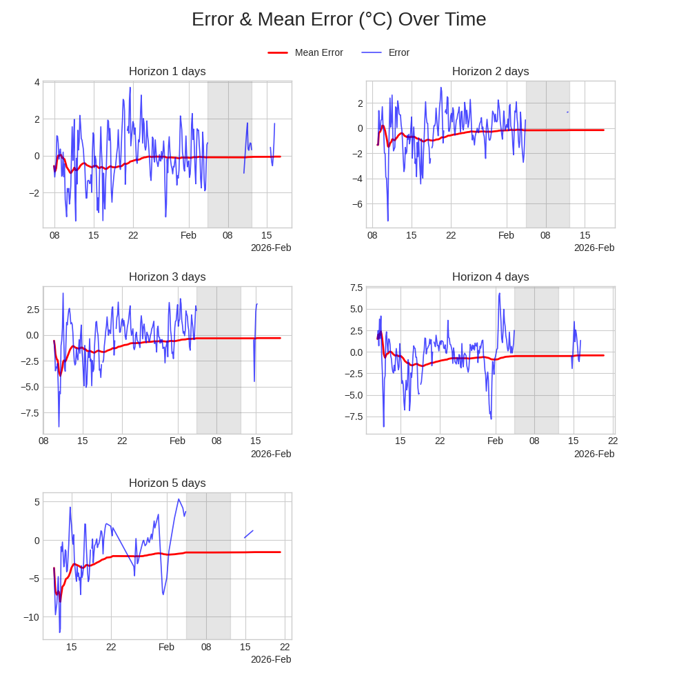

### Interpretation

*Interpretation will follow in a future update.*

<strong>🎯 4. Hit Rate (%) Over Time</strong>

 
  
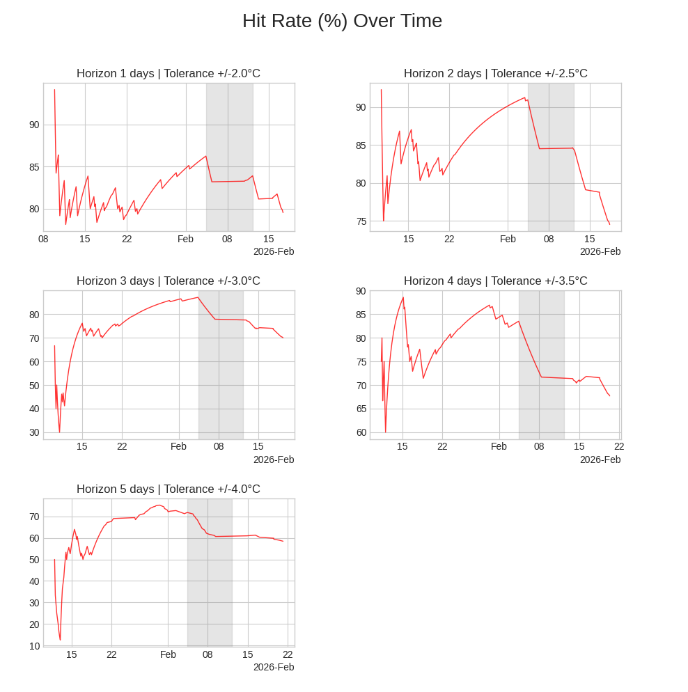

### Interpretation

*Interpretation will follow in a future update.*

<strong>📊 5. wMAPE (%) Over Time</strong>

 
  
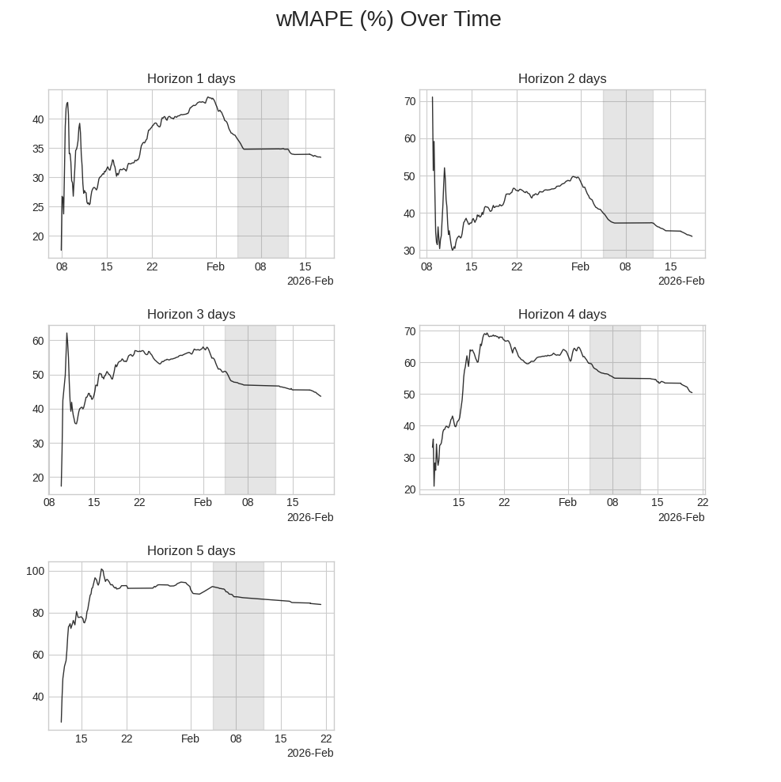

### Interpretation

*Interpretation will follow in a future update.*

<strong>📏 6. MAE & RMSE Over Time</strong>

 
  
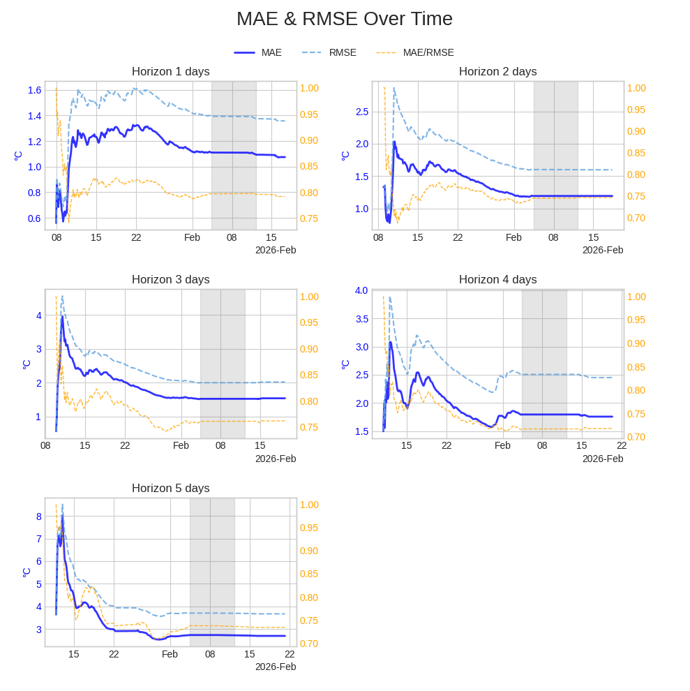

### Interpretation

*Interpretation will follow in a future update.*

<strong>🔎 7. Scatterplot of Forecast vs. Actual (°C)</strong>

 

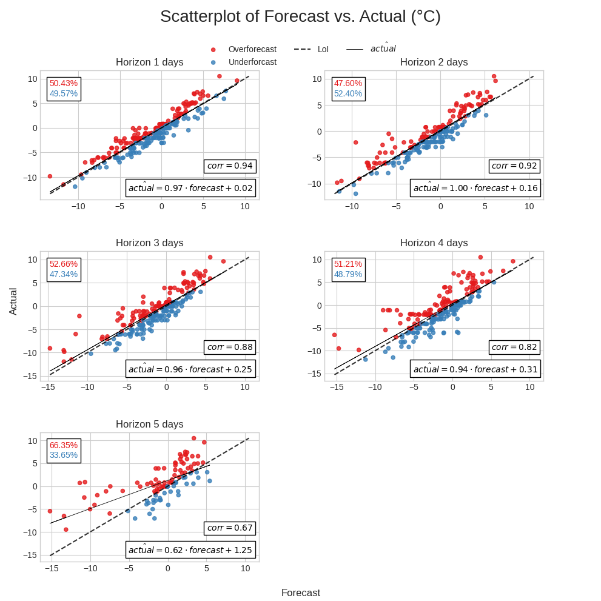

### Interpretation

*Interpretation will follow in a future update.*

<strong>📉 8. Error Distribution</strong>

### Key Metrics

|   Day |    Min |   25%-Perc. |   Mean |   Std |   Var |   Median |   75%-Perc. |   Max |   Skew |   Kurt |
|------:|-------:|------------:|-------:|------:|------:|---------:|------------:|------:|-------:|-------:|
|     1 |  -3.55 |       -0.94 |  -0.05 |  1.36 |  1.84 |    -0.03 |        0.84 |  3.71 |  -0.13 |  -0.04 |
|     2 |  -7.39 |       -0.96 |  -0.15 |  1.59 |  2.53 |     0.05 |        0.97 |  3.25 |  -0.93 |   1.81 |
|     3 |  -8.87 |       -1.3  |  -0.3  |  1.99 |  3.97 |    -0.07 |        1.04 |  4.04 |  -0.75 |   1.17 |
|     4 |  -8.72 |       -1.67 |  -0.41 |  2.42 |  5.84 |    -0.08 |        0.94 |  6.83 |  -0.59 |   1.42 |
|     5 | -12.06 |       -3.73 |  -1.58 |  3.31 | 10.96 |    -0.75 |        0.37 |  5.35 |  -0.68 |   0.55 |
 

### Distribution

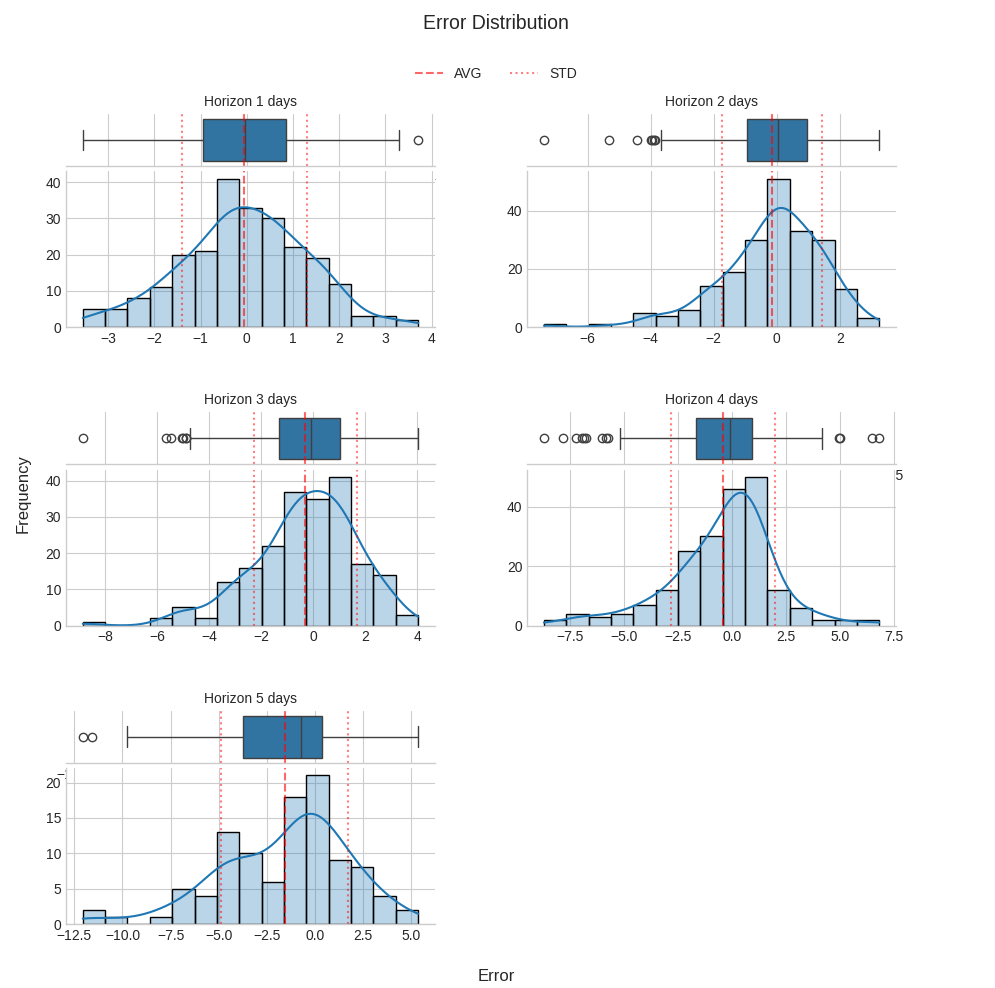

### Interpretation

*Interpretation will follow in a future update.*

<strong>🧾 Final Summary & Conclusion</strong>

### Key Findings

*Will follow in a future update.*

### Conclusion

*Conclusion will follow in a future update.*

